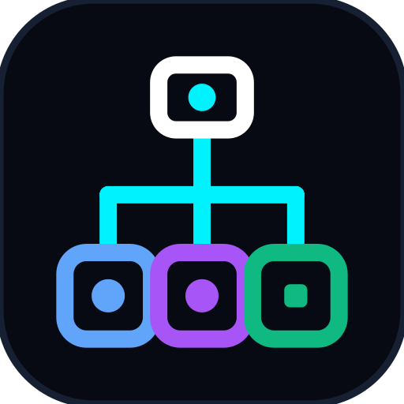

<div align="center">



# Aegis

**Site Reliability Engineering (SRE) Autonomous Debugging & Remediation Engine**

<p align="center">
  <a href="https://github.com/imshawan/aegis-dapl-agent"></a>
  <a href="https://www.typescriptlang.org/"></a>
  <a href="https://js.langchain.com/"></a>
  <a href="https://nodejs.org/"></a>
  <a href="https://bullmq.io/"></a>
  <a href="https://opensource.org/licenses/BSD-3-Clause"></a>
</p>

</div>

---

## Table of Contents
- [Executive Summary](#executive-summary)
- [Architecture Overview](#architecture-overview)
- [Core Capabilities](#core-capabilities)
  - [Dynamic Agentic Planning Loop (DAPL)](#dynamic-agentic-planning-loop-dapl)
  - [Multi-Model LLM Resilience & Sandbox Failover](#multi-model-llm-resilience--sandbox-failover)
  - [Real-Time Human-in-the-Loop Interrogation & Concurrency](#real-time-human-in-the-loop-interrogation--concurrency)
  - [LFU Fan-Out Memory Protection & Distributed Locking](#lfu-fan-out-memory-protection--distributed-locking)
  - [Security Firewall & Ingress Shielding](#security-firewall--ingress-shielding)
  - [GitOps & SOC2 Compliant Remediation](#gitops--soc2-compliant-remediation)
- [Production Deployment & Configuration](#production-deployment--configuration)
  - [Environment Variables Matrix](#environment-variables-matrix)
  - [Starting the Production Service](#starting-the-production-service)
- [Verification & Diagnostics Suite](#verification--diagnostics-suite)
- [Security & Governance](#security--governance)
- [License](#license)

---

## Executive Summary

Modern enterprise distributed systems generate substantial alert volumes during critical service outages. Traditional application monitoring and alerting pipelines (APMs) notify on-call engineering teams but leave the cognitive burden of stack trace isolation, version control correlation, root cause analysis (RCA), and remediation patch formulation entirely to human operators, often resulting in elevated Mean Time To Resolution (MTTR).

**Aegis (`aegis-dapl-agent`)** bridges the gap between observability and automated remediation. Built upon a **Dynamic Agentic Planning Loop (DAPL)**, Aegis acts as an autonomous on-call lead investigator. Upon receiving an incident webhook, it ingests error stack frames, isolates AST code boundaries around failure lines, evaluates recent Git blame history, formulates debugging hypotheses via iterative ReAct tool orchestration, and opens verified remediation pull requests directly in version control.

---

## Architecture Overview

Aegis is engineered as a highly fault-tolerant, horizontally scalable distributed system structured across five decoupled layers:


> **Comprehensive Engineering Documentation:**
> - **[System Architecture & Design Notes](./docs/architecture.md)** — Architectural breakdowns of the DAPL ReAct loop, relational integrity modeling (`jobId`), and human-in-the-loop Slack thread routing.
> - **[5-Layer Stack Diagram (SVG)](./docs/enterprise-layers.svg)** — Engineering systems architecture schematic.
> - **[6-Layer DAPL Workflow Diagram (SVG)](./docs/architecture-diagram.svg)** — Detailed ReAct investigation flowchart and subagent routing diagram.
> - **[Technical Implementation Guide](./docs/implementation.md)** — Detailed module specifications, subagent tool definitions, multi-model LLM failover behavior, and Least Frequently Used (LFU) memory protection algorithms.

---

## Core Capabilities

### Dynamic Agentic Planning Loop (DAPL)
Unlike static procedural automated scripts, Aegis leverages an autonomous ReAct loop (`OrchestratorAgent`). When investigating an outage, the agent formulates multiple competing hypotheses and dynamically invokes specialized subagent workers as tools (`spawn_code_scoper_worker`, `spawn_git_diff_worker`, `spawn_patch_worker`). It iteratively evaluates worker observations—looping up to 10 analytical turns—until a definitive root cause is validated.

### Multi-Model LLM Resilience & Sandbox Failover
Enterprise environments require uninterrupted availability, data privacy, and strict vendor redundancy. Aegis integrates first-class support for **Google Gemini** (`gemini-1.5-pro-latest`, `gemini-1.5-flash-latest`), **Anthropic Claude 3.5 Sonnet**, **OpenAI GPT-4o**, and local on-premise **Ollama** models (`llama3`, `qwen2.5-coder`, `deepseek-r1`). If cloud LLM endpoints are unconfigured or unreachable, the engine automatically fails over through local on-premise models before engaging defensive heuristic simulation mode for offline sandboxes (performing automated incident localization and git diagnostics without attempting code modifications without AI reasoning).

### Real-Time Human-in-the-Loop Interrogation & Concurrency
During live incident triage, engineering leaders require transparency into active automated investigations. Aegis provides a non-blocking conversational Slack query router:
- **Instant Acknowledgements**: When tagged with a new issue, Aegis immediately confirms receipt in Slack, returning the assigned master `jobId`.
- **Flexible Status Interrogation**: Operators can check progress at any time by replying directly inside an active investigation thread (`thread_ts`) OR by messaging the bot in group channels or personal DMs with the Job ID (e.g., `"what is the status of job id - sentry_live_50000"`).
- **Non-Blocking Orchestrator POV & Parallel Concurrency**: From the Orchestrator's POV, status checks read real-time snapshots from MongoDB (`status`, `workerTasks`, `promptMessages`) without halting active ReAct loop threads. When multiple outages occur simultaneously, parallel orchestrator instances run concurrently across distributed worker slots, isolated by master `jobId` and utilizing database checkpoints for crash resilience and idempotency.

### LFU Fan-Out Memory Protection & Distributed Locking
To maintain stability during high-throughput incident bursts (e.g., cascading microservice failures):
- **Distributed Mutex Locking**: Prevents concurrent execution race conditions across identical stack traces using Redis mutex locks with real-time audit monitoring.
- **LFU Memory Eviction**: Replaces unbounded in-memory maps with a custom Least Frequently Used (`LFUMemoryStore`) cache. When active capacity exceeds configurable thresholds (default: 500 jobs), least-accessed records are cleanly pruned and fanned out to archival sinks, preventing exponential memory growth.

### Zero-Trust Authentication, Security Firewall & Ingress Shielding
To protect the autonomous agent from unauthorized access, adversarial manipulation, and credential leakage, Aegis integrates a multi-layered security shielding architecture (`src/security/`):
- **Zero-Trust Webhook Authentication (`validateWebhookAccessKey`)**: Intercepts all ingress webhook POST requests (`/api/v1/webhooks/*`), validating active API tokens in the `accesskey` header before payload parsing or LLM evaluation.
- **Automated AWS Secrets Manager Rotation (`SecretsManagerService`)**: Directly integrates with AWS Secrets Manager via IAM Roles for Service Accounts (IRSA) and hourly background polling, enabling zero-downtime key rotation without restarting containers. Supports secondary fallback to `AEGIS_ACCESS_KEYS` for Kubernetes External Secrets Operator (ESO) workflows.
- **Prompt Injection & Jailbreak Prevention**: Intercepts adversarial prompt manipulation attempts (`ignore instructions`, `system override`, `DAN mode`), immediately rejecting them with HTTP `403 Forbidden`.
- **Directory Traversal & DoS Ceilings**: Blocks arbitrary file inclusion (`../../`, `/etc/passwd`, `.env`, `.ssh/`) during AST scoping and enforces strict size ceilings (max 50 KB alert / 5 KB chat).
- **Automated Secret Redaction**: Scrubs API keys, Bearer tokens, passwords, and private keys (`[REDACTED_...]`) prior to database storage or LLM prompt formulation.

### GitOps & SOC2 Compliant Remediation
All automated code changes are generated with strict scoping controls. Aegis isolates $\pm20$ lines around verified error frames, generates clean JSON diff specifications, creates isolated remediation git branches, and opens draft Pull Requests for engineering sign-off—maintaining compliance with peer-review policies.

---

## Production Deployment & Configuration

### Environment Variables Matrix

Copy the reference `.env.example` configuration file to initialize environment settings:

```bash
cp .env.example .env
```

| Variable Name | Status | Default | Description |
| :--- | :--- | :--- | :--- |
| `APP_NAME` | Optional | `aegis-dapl-agent` | Application identity string used in log telemetry and distributed mutex keys. |
| `PORT` | Optional | `3000` | HTTP port for incoming APM webhooks and health check endpoints. |
| `MONGODB_URI` | Required | `mongodb://localhost:27017/aegis_db` | Connection string for master relational job and checkpoint persistence. |
| `REDIS_HOST` / `PORT` | Required | `localhost` / `6379` | Redis host configuration for BullMQ job scheduling and distributed mutex locking. |
| `REDIS_LOCK_DURATION_MS` | Optional | `600000` | Distributed mutex lock TTL duration in milliseconds (default: 10 minutes). |
| `GEMINI_API_KEY` | Recommended | — | Primary API key for Google Gemini Generative AI endpoints. |
| `GEMINI_MODEL` | Optional | `gemini-1.5-pro-latest` | Google Gemini model identifier (supports `gemini-1.5-flash-latest`, `gemini-pro`). |
| `ANTHROPIC_API_KEY` | Optional | — | Failover API key for Anthropic Claude models. |
| `ANTHROPIC_MODEL` | Optional | `claude-3-5-sonnet-20241022` | Anthropic Claude model identifier. |
| `OPENAI_API_KEY` | Optional | — | Failover API key for OpenAI GPT models. |
| `OPENAI_MODEL` | Optional | `gpt-4o` | OpenAI model identifier (supports `gpt-4o`, `gpt-4-turbo`, `o1`). |
| `OLLAMA_BASE_URL` | Optional | `http://localhost:11434/v1` | Base URL for local Ollama or OpenAI-compatible on-premise LLM server. |
| `OLLAMA_MODEL` | Optional | — | Local Ollama model identifier (e.g., `llama3`, `qwen2.5-coder`, `deepseek-r1`) for air-gapped on-premise execution. |
| `LLM_QUERY_TIMEOUT_MS` | Optional | `30000` | Maximum timeout in milliseconds for mid-job Slack status query evaluation before engaging offline status fallback. Note: Does NOT apply to main background incident investigations, which run asynchronously without timeouts. |
| `GITHUB_TOKEN` | Required | — | Personal access token or GitHub App token with repository read/write permissions. |
| `SLACK_BOT_TOKEN` | Optional | — | Bot user OAuth token for Slack interactive mid-job thread routing and alert notifications. |
| `AEGIS_ACCESS_KEYS` | Optional | `aegis_live_key_99x7,...` | Comma-separated API access keys for zero-trust webhook authentication (Sentry, Slack, CI/CD). |
| `AWS_REGION` | Optional | `us-east-1` | AWS region for automated AWS Secrets Manager integration. |
| `AWS_SECRETS_MANAGER_SECRET_ID` | Optional | — | AWS Secret Name or ARN (`aegis/production/webhook-keys`) for zero-downtime automated access key rotation. |
| `AWS_SECRET_POLL_INTERVAL_MS` | Optional | `3600000` | Background rotation polling interval in milliseconds (default: 1 hour). |

### Starting the Production Service

Initialize the production application build and launch the server and background workers:

```bash
# Compile TypeScript to production JavaScript bundle
npm run build

# Launch production server and background queue consumer
npm start
```

---

## Verification & Diagnostics Suite

Aegis includes an diagnostic test suite to validate system integrity, memory management, and distributed locking without requiring live external dependencies:

```bash
# Execute entire 7-suite diagnostic test harness via Node's native test runner (40 tests total)
npm run test

# Execute end-to-end simulation of the Dynamic Agentic Planning Loop (ReAct loop + PR generation)
GEMINI_API_KEY=your_key_here npm run test:orchestrator

# Validate LFU memory store capacity overflow, usage-frequency sorting, and fan-out eviction
npm run test:lfu

# Verify distributed mutex lock acquisition, concurrency prevention, and audit failover resilience
npm run test:lock

# Verify modular webhook payload normalizers (Sentry APM, Slack, Raw Traceback formats)
npm run test:simulation

# Verify Security Firewall (Prompt Injection defense, Directory Traversal blocking, and Secret Redaction)
npm run test:firewall

# Verify Negative & Adversarial Security Test Suite (18 adversarial boundary and controller rejection tests)
npm run test:security-negative

# Verify End-to-End Go Repository Remediation Suite (Precision block-patching & indentation resilience)
npm run test:go-remediation
```

---

## Security & Governance

Aegis enforces a comprehensive, defense-in-depth security architecture powered by its standalone **Security Firewall** (`src/security/agentFirewall.ts`):

```
[Untrusted Webhook / Slack Input] 
         │
         ▼
 ╔═══════════════════════════════════════════════════════════╗
 ║        Aegis Security Shield Layer (AgentFirewall)        ║
 ╟───────────────────────────────────────────────────────────╢
 ║ 1. DoS Ceiling Check (Max 50KB Alert / 5KB Chat)          ║
 ║ 2. Prompt Injection & Jailbreak Scanner                   ║
 ║ 3. Directory Traversal & OS File Inclusion Defense        ║
 ║ 4. Automated Secret & PII Scrubbing                       ║
 ╚═══════════════════════════════════════════════════════════╝
         │
         ├───────────────────────────────┐
         ▼ (Safe & Sanitized)            ▼ (Malicious Attack Detected)
[Enter BullMQ Queue / LLM Loop]  [Reject HTTP 403 Forbidden]
```

- **Prompt Injection & Jailbreak Defense**: All incoming Slack queries and error descriptions are scanned against curated adversarial signatures (`ignore previous instructions`, `system override`, `DAN mode`). Malicious inputs are immediately blocked with HTTP `403 Forbidden`.
- **Directory Traversal & File Inclusion Shielding**: Stack trace paths and AST scoping parameters are verified to block directory traversal (`../../`) and prevent access to sensitive OS/configuration files (`/etc/passwd`, `.env`, `.ssh/id_rsa`).
- **Denial of Service (DoS) Ceilings**: Enforces strict payload size ceilings (max 50 KB for alerts, max 5 KB for conversational chat) to prevent OOM exhaustion.
- **Automated Secret Hygiene**: Bearer tokens, Google API keys, OpenAI/Anthropic credentials, Slack bot tokens, database passwords, and private keys are scrubbed and replaced with `[REDACTED_...]` markers before database storage or LLM evaluation.
- **Least Privilege Access**: Subagent workers operate with read-only repository access during source AST scoping (`CodeScoperWorker`) and commit blame analysis (`GitDiffWorker`). Write permissions are restricted exclusively to branch creation and draft PR formulation (`PatchWorker`).

---

## License

Copyright &copy; 2026 Shawan Mandal. Licensed under the **BSD 3-Clause License**.
