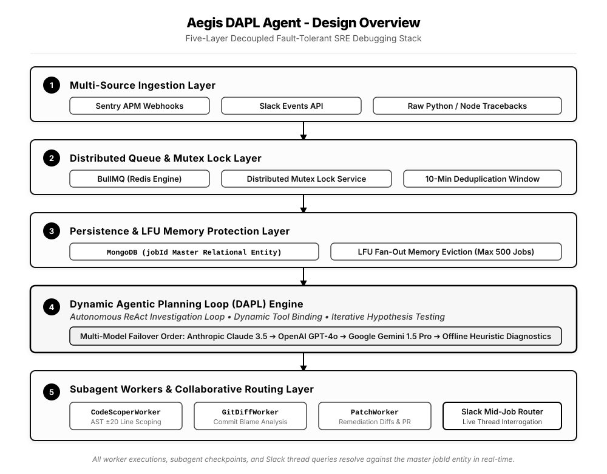

# Aegis

**Enterprise Site Reliability Engineering (SRE) Autonomous Debugging & Remediation Engine**

[](https://github.com/your-org/aegis-idras)
[](https://www.typescriptlang.org/)
[](https://js.langchain.com/)
[](https://nodejs.org/)
[](https://bullmq.io/)
[](https://opensource.org/licenses/ISC)

---

## Executive Summary

Modern enterprise distributed systems generate substantial alert volumes during critical service outages. Traditional application monitoring and alerting pipelines (APMs) notify on-call engineering teams but leave the cognitive burden of stack trace isolation, version control correlation, root cause analysis (RCA), and remediation patch formulation entirely to human operators—often resulting in elevated Mean Time To Resolution (MTTR).

**Aegis (`aegis-dapl-agent`)** bridges the gap between observability and automated remediation. Built upon a **Dynamic Agentic Planning Loop (DAPL)**, Aegis acts as an autonomous on-call lead investigator. Upon receiving an incident webhook, it ingests error stack frames, isolates AST code boundaries around failure lines, evaluates recent Git blame history, formulates debugging hypotheses via iterative ReAct tool orchestration, and opens verified remediation pull requests directly in version control.

---

## Enterprise Architecture Overview

Aegis is engineered as a highly fault-tolerant, horizontally scalable distributed system structured across five decoupled layers:



> **Comprehensive Engineering Documentation:**
> - **[System Architecture & Design Notes](./docs/architecture.md)** — Architectural breakdowns of the DAPL ReAct loop, relational integrity modeling (`jobId`), and human-in-the-loop Slack thread routing.
> - **[5-Layer Enterprise Stack Diagram (SVG)](./docs/enterprise-layers.svg)** — Engineering systems architecture schematic.
> - **[6-Layer DAPL Workflow Diagram (SVG)](./docs/architecture-diagram.svg)** — Detailed ReAct investigation flowchart and subagent routing diagram.
> - **[Technical Implementation Guide](./docs/implementation.md)** — Detailed module specifications, subagent tool definitions, multi-model LLM failover behavior, and Least Frequently Used (LFU) memory protection algorithms.

---

## Core Enterprise Capabilities

### Dynamic Agentic Planning Loop (DAPL)
Unlike static procedural automated scripts, Aegis leverages an autonomous ReAct loop (`OrchestratorAgent`). When investigating an outage, the agent formulates multiple competing hypotheses and dynamically invokes specialized subagent workers as tools (`spawn_code_scoper_worker`, `spawn_git_diff_worker`, `spawn_patch_worker`). It iteratively evaluates worker observations—looping up to 10 analytical turns—until a definitive root cause is validated.

### Multi-Model LLM Resilience & Sandbox Failover
Enterprise environments require uninterrupted availability and strict vendor redundancy. Aegis integrates first-class support for **Google Gemini** (`gemini-1.5-pro-latest`, `gemini-1.5-flash-latest`), **Anthropic Claude 3.5 Sonnet**, and **OpenAI GPT-4o**. If primary LLM endpoints experience latency or rate-limiting, the engine automatically fails over through secondary providers or engages deterministic heuristic simulation mode for offline sandboxes.

### Real-Time Human-in-the-Loop Interrogation
During live incident triage, engineering leaders require transparency into active automated investigations. Aegis provides a non-blocking Slack query router. By replying directly to an active incident notification thread (`thread_ts`), operators can interrogate the agent regarding its current reasoning state, worker task progress, or DB checkpoints without halting or restarting background processing threads.

### LFU Fan-Out Memory Protection & Distributed Locking
To maintain stability during high-throughput incident bursts (e.g., cascading microservice failures):
- **Distributed Mutex Locking**: Prevents concurrent execution race conditions across identical stack traces using Redis mutex locks with real-time audit monitoring.
- **LFU Memory Eviction**: Replaces unbounded in-memory maps with a custom Least Frequently Used (`LFUMemoryStore`) cache. When active capacity exceeds configurable thresholds (default: 500 jobs), least-accessed records are cleanly pruned and fanned out to archival sinks, preventing exponential memory growth.

### GitOps & SOC2 Compliant Remediation
All automated code changes are generated with strict scoping controls. Aegis isolates $\pm20$ lines around verified error frames, generates clean JSON diff specifications, creates isolated remediation git branches, and opens draft Pull Requests for engineering sign-off—maintaining compliance with enterprise peer-review policies.

---

## Production Deployment & Configuration

### Environment Variables Matrix

Copy the reference `.env.example` configuration file to initialize environment settings:

```bash
cp .env.example .env
```

| Variable Name | Status | Default | Description |
| :--- | :--- | :--- | :--- |
| `APP_NAME` | Optional | `aegis-dapl-agent` | Application identity string used in log telemetry and distributed mutex keys. |
| `PORT` | Optional | `3000` | HTTP port for incoming APM webhooks and health check endpoints. |
| `MONGODB_URI` | Required | `mongodb://localhost:27017/aegis_db` | Connection string for master relational job and checkpoint persistence. |
| `REDIS_HOST` / `PORT` | Required | `localhost` / `6379` | Redis host configuration for BullMQ job scheduling and distributed mutex locking. |
| `REDIS_LOCK_DURATION_MS` | Optional | `600000` | Distributed mutex lock TTL duration in milliseconds (default: 10 minutes). |
| `GEMINI_API_KEY` | Recommended | — | Primary API key for Google Gemini Generative AI endpoints. |
| `GEMINI_MODEL` | Optional | `gemini-1.5-pro-latest` | Google Gemini model identifier (supports `gemini-1.5-flash-latest`, `gemini-pro`). |
| `ANTHROPIC_API_KEY` | Optional | — | Failover API key for Anthropic Claude models (`claude-3-5-sonnet-20241022`). |
| `OPENAI_API_KEY` | Optional | — | Failover API key for OpenAI GPT models (`gpt-4o`). |
| `GITHUB_TOKEN` | Required | — | Personal access token or GitHub App token with repository read/write permissions. |
| `SLACK_BOT_TOKEN` | Optional | — | Bot user OAuth token for Slack interactive mid-job thread routing and alert notifications. |

### Starting the Production Service

Initialize the production application build and launch the server and background workers:

```bash
# Compile TypeScript to production JavaScript bundle
npm run build

# Launch production server and background queue consumer
npm start
```

---

## Verification & Diagnostics Suite

Aegis includes an enterprise diagnostic test suite to validate system integrity, memory management, and distributed locking without requiring live external dependencies:

```bash
# Execute end-to-end simulation of the Dynamic Agentic Planning Loop (ReAct loop + PR generation)
GEMINI_API_KEY=your_key_here npm run test:orchestrator

# Validate LFU memory store capacity overflow, usage-frequency sorting, and fan-out eviction
npm run test:lfu

# Verify distributed mutex lock acquisition, concurrency prevention, and audit failover resilience
npm run test:lock

# Verify modular webhook payload normalizers (Sentry APM, Slack, Raw Traceback formats)
npm run test:simulation
```

---

## Security & Governance

- **Least Privilege Access**: Aegis subagents operate with read-only repository access during source AST scoping (`CodeScoperWorker`) and commit blame analysis (`GitDiffWorker`). Write permissions are restricted exclusively to branch creation and draft PR formulation (`PatchWorker`).
- **Secret Hygiene**: Stack trace normalization pipelines scrub environment secrets, API keys, and authorization headers from payload frames prior to persistence or LLM prompt formulation.

---

## License

Copyright &copy; 2026 Shawan Mandal. Licensed under the **ISC License**.
