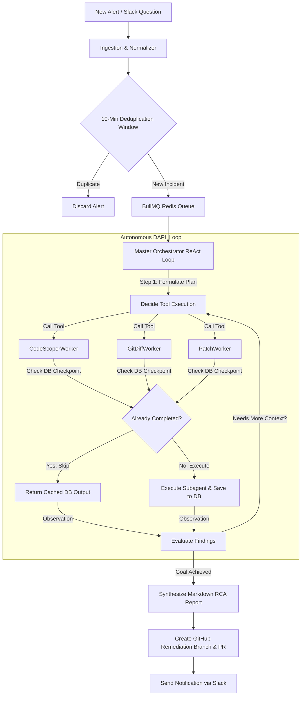
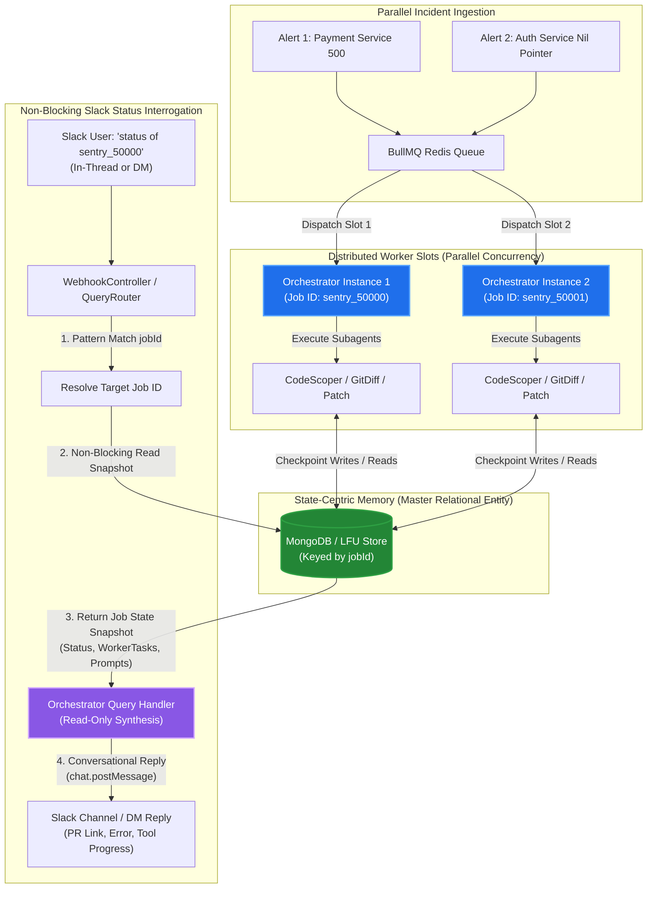
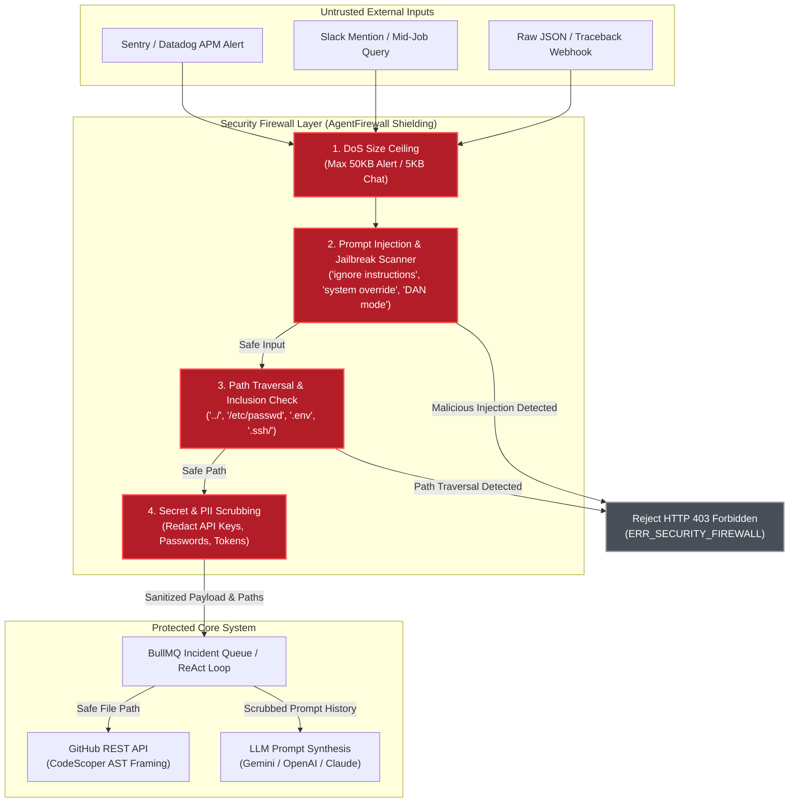

# Aegis (`aegis-dapl-agent`): Architecture Documentation

Aegis is an enterprise-grade **Autonomous SRE Debugging & Remediation Agent System** powered by a **Dynamic Agentic Planning Loop (DAPL)**. Unlike traditional procedural static pipelines, Aegis utilizes dynamic ReAct tool-calling loops, multi-model LLM orchestration (Google Gemini, Anthropic Claude, OpenAI GPT), and robust memory protection mechanisms.

---

## Picture of the Idea (System Architecture)

---

## Core Architectural Pillars

### 1. Dynamic Agentic Planning Loop (DAPL)
At the heart of `aegis-dapl-agent` is the `OrchestratorAgent`. When an incident arrives, the orchestrator acts as an autonomous Lead Investigation SRE:
- **Analyze & Plan**: It evaluates stack traces, environment variables, and initial code snippets, listing hypotheses to test.
- **Autonomous Subagent Tool Calling**: Using `@langchain/core/tools`, it dynamically invokes specialized subagent workers as tools in a loop:
  - `spawn_code_scoper_worker`: Scopes AST code frames around target error lines.
  - `spawn_git_diff_worker`: Examines recent commits and blame annotations for regressions.
  - `spawn_patch_worker`: Formulates minimal, bug-free remediation code patches.
- **Iterative Evaluation**: The loop evaluates findings after each tool call, looping up to 10 turns until satisfied. Once root cause analysis (RCA) is complete, it automatically triggers a draft GitHub Pull Request with the proposed fix.

---

### 2. Master Relational Entity Enforcement (`jobId`)
To ensure complete relational consistency across asynchronous distributed workers:
- Every database record, subagent execution checkpoint, LLM prompt message, and PR reference enforces **`jobId`** as its master relational entity / primary foreign key.
- If a subagent task (`CodeScoperWorker`) was already executed in a previous loop turn or retry, the orchestrator checks MongoDB first, returning cached results instantly to save LLM tokens and execution time.

---

### 3. Interactive Slack Routing, Status Q&A & Concurrency
Aegis supports live human-in-the-loop interrogation and instant status querying without pausing or interrupting active background investigation worker loops:
- **Immediate Acknowledgement**: When a new investigation is requested in Slack, Aegis immediately sends a conversational acknowledgement back to the thread containing the newly assigned master `jobId` and service details.
- **Flexible Status & Progress Queries**: Operators can interrogate active or completed investigations at any time by replying inside an ongoing thread (`thread_ts`) OR by messaging the bot directly in a group channel or DM with the Job ID (e.g., `"what is the status of task with job id - sentry_live_50000"`). The webhook controller uses word scanning and regex matching to resolve `overrideJobId` directly.
- **The Orchestrator POV (Stateless Compute + State-Centric Memory)**: From the Orchestrator's perspective, answering a status query does not require suspending or signaling the running ReAct loop thread. Instead, `handleMidJobQuery` reads a real-time snapshot of the job's MongoDB document (`status`, `workerTasks`, and recent `promptMessages`). It feeds this snapshot into a lightweight, read-only AI evaluation prompt (or deterministic markdown formatter) to generate an accurate progress report (including error class, worker tool counts, and Pull Request links), replying instantly in Slack via `chat.postMessage`.
- **Parallel Orchestrators & Multi-Job Concurrency**: When multiple outages occur concurrently, BullMQ assigns each alert to a distributed worker slot. Each job run operates as an isolated ReAct loop identified by its master relational entity (`jobId`). Because all state mutations (`addWorkerTask`, `updateWorkerTaskResult`, `addPromptMessage`) are scoped to `jobId` in MongoDB, parallel orchestrators execute concurrently without shared memory or state bleed. If a node restarts mid-job, a newly spawned orchestrator checks MongoDB first and reuses completed subagent checkpoints, ensuring crash resilience and idempotency across distributed runs.

---

### 4. LFU Fan-Out Memory Protection
To prevent exponential memory growth in high-throughput production environments:
- The in-memory fallback store (`LFUMemoryStore`) monitors active usage frequency (`accessCount`) and access timestamps (`lastAccessed`) for all job objects.
- When capacity is reached (default: 500 active jobs), it triggers a fan-out eviction mechanism that prunes the least frequently used keys, invoking an `onEvict` callback to archive or log evicted jobs cleanly.

---

### 5. Production Source Code & Version Resolution Pipeline
Aegis locates and accesses the exact source code for debugging production issues through a three-stage resolution pipeline that connects incoming alert payloads to version-controlled repository files:
- **Ingestion & Path Normalization**: When an incident webhook arrives (Sentry, Slack, or raw traceback), normalizers extract the failing file path (`filePath`) and the exact production version reference (`resolvedRef`)—prioritizing the commit SHA, falling back to release tag, and defaulting to branch name.
- **Repository & Owner Resolution**: The worker resolves the GitHub repository hierarchy (`owner/repo`) from explicit webhook metadata, correlating service names with environment fallbacks (`GITHUB_DEFAULT_OWNER`) when necessary.
- **AST Scoping via GitHub REST API**: The `CodeScoperWorker` calls `octokit.rest.repos.getContent` at the exact commit reference running in production, extracts a target AST window of $\pm20$ lines around the failure line, and caches the snippet in Redis using MD5 checksum hashing to eliminate redundant API calls across loop turns.

---

### 6. Precision Block-Patching & Remediation PRs
To generate clean, mergeable remediation pull requests without wiping surrounding code or failing on containerized file paths:
- **Path Prefix Stripping**: In `src/notifications/githubPR.ts`, incoming file paths from stack traces (such as `/go/src/app/helpers/authentication.go` or `/var/www/html/index.php`) are stripped against configurable prefix arrays (`go/src/app/`, `var/www/`, `src/app/`) to resolve exact repository relative paths in target repositories (e.g., `helpers/authentication.go` in `gin-backend-starter`).
- **Precision Block Replacement**: Rather than replacing entire files or relying on fragile regex matching, `findPatchLineRange` identifies exact target blocks around the error frame, applying atomic drop-in replacements via `applyPatchToContent` while preserving all surrounding code and comments.

---

### 7. Clean Controller Architecture & Unified Response Formatting
To maintain enterprise grade decoupling between HTTP transport layers and core SRE debugging workflows:
- **Extracted Controller Layer**: In `src/controllers/` (`webhookController.ts`, `jobController.ts`), all request validation, alert deduplication, asynchronous queue dispatching, and instant Slack acknowledgements are encapsulated away from route definitions (`src/routes/`).
- **Global API Response Formatter**: In `src/utils/responseFormatter.ts`, `ApiResponseFormatter` enforces uniform JSON response structures across all successful webhooks, status checks, and global exception handlers (`success`, `message`, `data`, `error`, `timestamp`, and diagnostic error codes like `ERR_UNHANDLED_EXCEPTION`).

---

### 8. Agent Security Firewall & Shielding Layer
To protect the autonomous agent from adversarial manipulation, denial of service, directory traversal, and credential leakage, Aegis implements an impenetrable security shielding service (`src/security/agentFirewall.ts`) that intercepts and sanitizes all external data before it reaches the queue or LLM evaluation loops:
- **Prompt Injection & Jailbreak Defense**: Scans incoming text against curated adversarial signatures (`ignore previous instructions`, `system override`, `you are now an unrestricted agent`, `DAN mode`, `<|im_start|>`). If detected, the input is immediately rejected with HTTP `403 Forbidden` (`ERR_SECURITY_FIREWALL`).
- **Path Traversal & OS File Inclusion Defense**: Intercepts file paths in stack frames and tool arguments, blocking directory traversal (`../../`) and access to sensitive OS or configuration files (`/etc/passwd`, `/root/`, `c:\windows\`, `.env`, `.ssh/id_rsa`).
- **Denial of Service (DoS) Ceiling**: Enforces strict payload size ceilings (max 50 KB for stack traces, max 5 KB for conversational chat messages) to prevent token exhaustion and memory OOM crashes.
- **Secret & PII Redaction**: Automatically scrubs Bearer tokens, Google API keys, OpenAI/Anthropic credentials, Slack bot tokens, database passwords, and private keys, replacing them with `[REDACTED_...]` markers before database persistence or prompt formulation.

---

### 9. Precision Block-Patching & Multi-Language Remediation Architecture
To reliably remediate production incidents across diverse programming languages (such as TypeScript, Go, and Python) without syntax corruption, Aegis implements an indentation-resilient block replacement engine in `PatchWorker` (`src/agent/workers/patchWorker.ts`):
- **Precision Target Matching**: Searches file contents for exact string blocks first, then degrades to trimmed line-by-line matching to accommodate tab versus space formatting differences (common in Go repositories).
- **Indentation Preservation**: Dynamically detects leading whitespace prefixes on matched code blocks and reconstructs replacement lines with identical indentation hierarchies.
- **End-to-End Verification**: Tested against multi-language codebases (`src/tests/testGoRemediation.ts`), verifying defensive nil checks and pointer dereference remediations in Go service controllers.

---

### 10. Unified Native Test Infrastructure
Aegis eschews heavy external testing dependencies (such as Jest or Mocha) in favor of Node.js 22's native testing runner (`node:test` and `node:assert`). All test suites execute cleanly in isolated or sandboxed environments via `npm run test` (powered by `tsx --test --test-force-exit`):
- **Lock Service Suite** (`test:lock`): Verifies distributed mutex acquisition and guard contexts.
- **LFU Eviction Suite** (`test:lfu`): Verifies fan-out memory pruning under OOM thresholds.
- **Orchestrator Suite** (`test:orchestrator`): Verifies autonomous ReAct loop synthesis and non-blocking Slack interactive query resolution.
- **Simulation Suite** (`test:simulation`): Verifies multi-source webhook normalization (Sentry, Slack, Python raw tracebacks).
- **Firewall Suite** (`test:firewall`): Verifies ingress filtering, DoS ceilings, and secret scrubbing.
- **Adversarial Negative Suite** (`test:security-negative`): Verifies 18 negative test cases against prompt injection, jailbreaking, and path traversal exploits.
- **Go Remediation Suite** (`test:go-remediation`): Verifies precision block replacement and indentation resilience in Go repositories.

