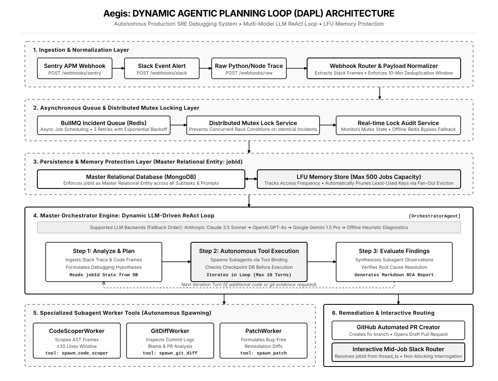
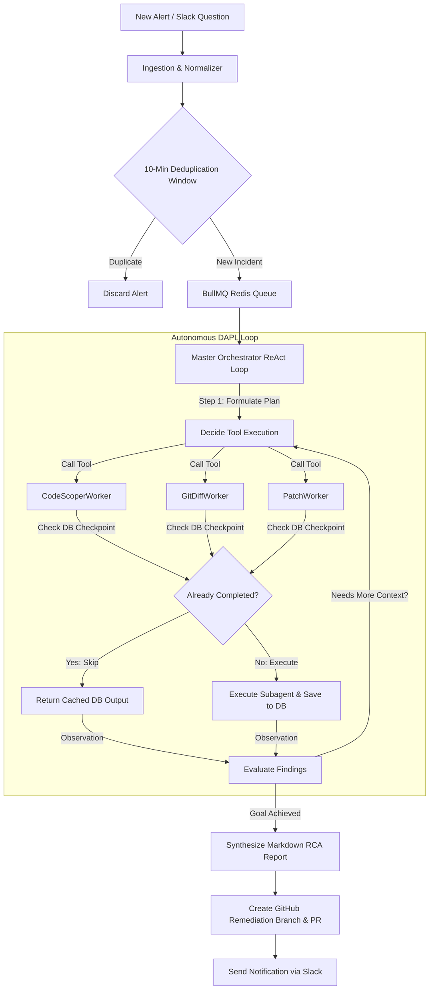

# Aegis (`aegis-dapl-agent`): Architecture Documentation

Aegis is an enterprise-grade **Autonomous SRE Debugging & Remediation Agent System** powered by a **Dynamic Agentic Planning Loop (DAPL)**. Unlike traditional procedural static pipelines, Aegis utilizes dynamic ReAct tool-calling loops, multi-model LLM orchestration (Google Gemini, Anthropic Claude, OpenAI GPT), and robust memory protection mechanisms.

---

## Picture of the Idea (System Architecture)

---

## Core Architectural Pillars

### 1. Dynamic Agentic Planning Loop (DAPL)
At the heart of `aegis-dapl-agent` is the `OrchestratorAgent`. When an incident arrives, the orchestrator acts as an autonomous Lead Investigation SRE:
- **Analyze & Plan**: It evaluates stack traces, environment variables, and initial code snippets, listing hypotheses to test.
- **Autonomous Subagent Tool Calling**: Using `@langchain/core/tools`, it dynamically invokes specialized subagent workers as tools in a loop:
  - `spawn_code_scoper_worker`: Scopes AST code frames around target error lines.
  - `spawn_git_diff_worker`: Examines recent commits and blame annotations for regressions.
  - `spawn_patch_worker`: Formulates minimal, bug-free remediation code patches.
- **Iterative Evaluation**: The loop evaluates findings after each tool call, looping up to 10 turns until satisfied. Once root cause analysis (RCA) is complete, it automatically triggers a draft GitHub Pull Request with the proposed fix.

---

### 2. Master Relational Entity Enforcement (`jobId`)
To ensure complete relational consistency across asynchronous distributed workers:
- Every database record, subagent execution checkpoint, LLM prompt message, and PR reference enforces **`jobId`** as its master relational entity / primary foreign key.
- If a subagent task (`CodeScoperWorker`) was already executed in a previous loop turn or retry, the orchestrator checks MongoDB first, returning cached results instantly to save LLM tokens and execution time.

---

### 3. Interactive Mid-Job Slack Routing (Thread-to-Job Resolution)
Aegis supports live human-in-the-loop interrogation without pausing or interrupting active background investigation workers:
- When a user asks a question inside a Slack investigation thread (`thread_ts`), `webhookRouter.ts` catches the event.
- It queries MongoDB to resolve the master `jobId` from the thread ID.
- It calls `orchestratorAgent.handleMidJobQuery(jobId, question)`, which inspects the active job's prompt history, worker task progress, and reasoning state in real-time, replying directly to the user in Slack.

---

### 4. LFU Fan-Out Memory Protection
To prevent exponential memory growth in high-throughput production environments:
- The in-memory fallback store (`LFUMemoryStore`) monitors active usage frequency (`accessCount`) and access timestamps (`lastAccessed`) for all job objects.
- When capacity is reached (default: 500 active jobs), it triggers a fan-out eviction mechanism that prunes the least frequently used keys, invoking an `onEvict` callback to archive or log evicted jobs cleanly.
